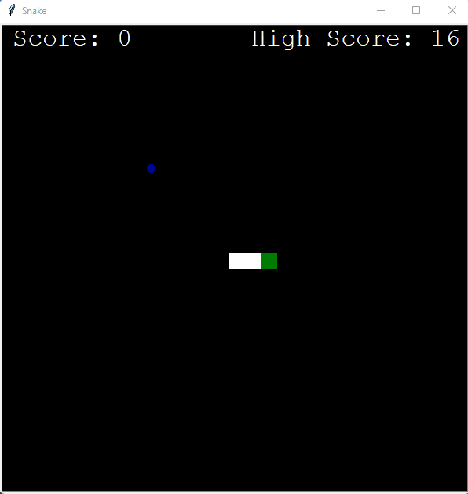

<<<<<<< HEAD
# Python Snake
Python Snake game using the turtle module. Developed as a learning project.

</img>

main.py:
--------
* Creates the game objects, game window and runs the game loop. 
* The game run continuously until you exit the window. 

snake.py:
-------
* An extention of the Turtle class for creating and controlling the snake.

food.py:
-------
* An extention of the Turtle class for creating and controlling the foods position.

scoreboard.py:
-------
* An extention of the Turtle class for screen writing scores and game over. 
* Tracks current score and highscore. Highscore is read from .txt file and a new highscore is written to the txt file.
=======
# Python Snake Game
Python Snake game using the turtle module. Developed as a learning project.
>>>>>>> c02d4f2685600a7906fb9ec45569daeaae84293b
